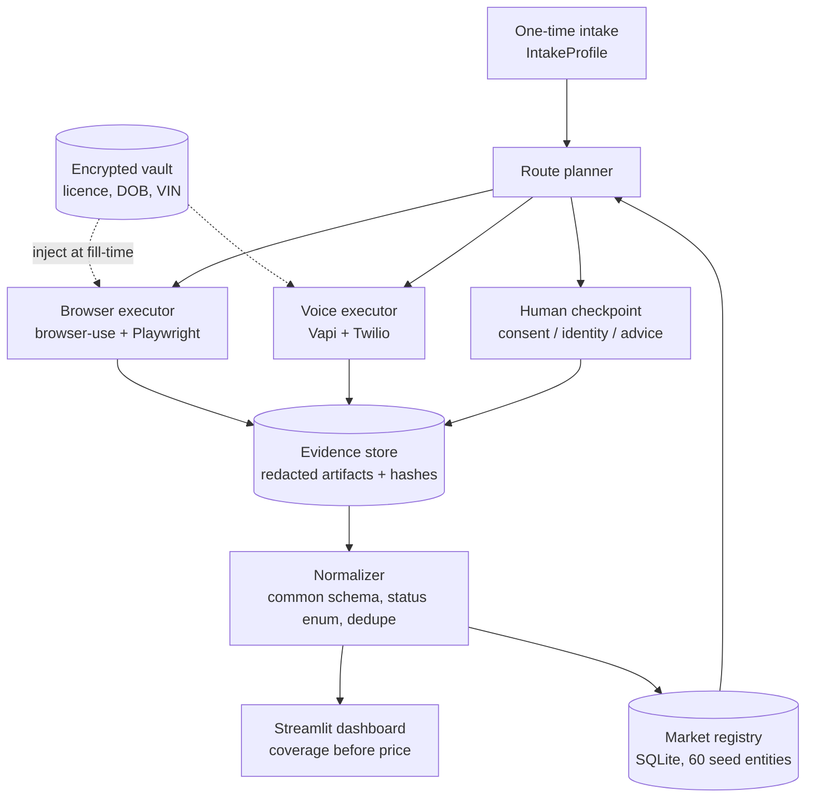

# Architecture

Personal quote-retrieval agent. One intake → planned routes → executors →
evidence → normalized comparison. Nothing exists without evidence.

## Pipeline



## Directory layout

```
all-quote/
├── CLAUDE.md  PLAN.md  Makefile  pyproject.toml  .env.example
├── docs/                  ARCHITECTURE.md SCHEMAS.md GUARDRAILS.md
├── allquote/
│   ├── schemas.py         # ALL pydantic models + Status enum (source of truth: docs/SCHEMAS.md)
│   ├── registry.py        # SQLite store, seed loader, stats, export
│   ├── vault.py           # Fernet vault; only holder of sensitive values
│   ├── redact.py          # text + image redaction; used by evidence only
│   ├── evidence.py        # ONLY writer to data/evidence/; redact→hash→index
│   ├── planner.py         # route → executor decisions, bounded-attempt policy
│   ├── normalize.py       # raw result → QuoteResult; dedupe resolver
│   ├── metrics.py         # market_completion, comparable_quote_yield, evidence_rate,
│   │                      # duplicate_suppression, freshness (docs/SCHEMAS.md Metrics)
│   ├── executors/
│   │   ├── browser.py     # browser-use agent wrapper
│   │   └── voice.py       # Vapi client + webhook outcome handler
│   └── dashboard.py       # Streamlit UI
├── data/                  # git-ignored: allquote.db, vault.enc, evidence/
│   └── seed_registry.json # git-tracked: Appendix A seed (no personal data)
└── exports/               # git-ignored; generated CSV/JSON/report
```

## Data flow rules

1. IntakeProfile is collected once and stored WITHOUT sensitive fields; those go to
   the vault. Profile carries vault references, not values.
2. Planner reads registry, emits a RunPlan: (route, executor, requirements check).
   Routes failing requirements never reach an executor — they get a terminal status
   at planning time (ineligible / manual_handoff / affinity_restricted) with reason.
3. Executors are dumb about markets and smart about journeys. They receive one
   MarketRecord + profile, do the journey, and return a raw outcome. They do not
   decide comparability — the normalizer does.
4. Evidence first: an executor saves evidence BEFORE returning; a result row without
   an evidence_artifact is invalid at the schema level.
5. Normalizer converts raw outcome → QuoteResult, computes coverage diffs vs the
   benchmark, assigns/looks up distinct_rate_source_id, writes back registry status.
6. Dashboard is read-only over SQLite except the delete-all action.

## Dedupe model (brand ≠ underwriter ≠ rate source)

Layers: consumer brand → legal_underwriter → insurer_group. A distinct rate source
is keyed by (legal_underwriter, product_scope/program). Two routes resolving to the
same key share one distinct_rate_source_id; the later one is recorded as
duplicate_rate_source with a pointer, never counted twice in metrics.
Example: an aggregator returning "Economical" collapses into the same node as a
Definity broker quote; belairdirect and Intact broker remain distinct rate sources
within one group if programs differ.

## Model tiering

Browser executor model set per run: MODEL_CHEAP (default, DOM-only) for routine
journeys; MODEL_SMART for demo runs and previously failed routes. Vision flag off
by default; enable per-route via registry automation_notes.
Successful traversals may be compiled to deterministic Playwright replay scripts
(action-history → script) for cheap re-verification; agentic first pass remains the
discovery mechanism.

## Bounded attempts (implements brief's policy)

Web: 1 attempt + 1 retry on transient technical error only; max_steps cap per run.
Voice: 1 call + 1 retry only if line fails before connect.
CAPTCHA / rejection / terms block: record `blocked`, never retry, never evade.
Unresolved stays unresolved — never silently dropped from metrics denominators.
